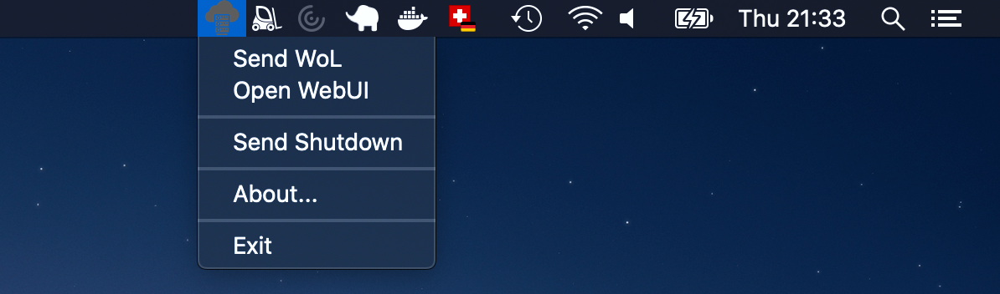

# NASControl (with Driver for TrueNAS/FreeNAS)
Send a WoL (wake on lan) packet from your mac or pc to your NAS (network attached storage) device. It integrates into the SystemTray with a tiny icon. You have to build it from source yourself. It's written in Java.

## Prerequisite
- Maven 3.6.2 or higher
- JDK 1.8 or higher

## Build

```
mvn clean package
```

## Run (for testing with log on the console)
```
java -jar ./target/nascontrol.jar
```

## Create .dmg image for MacOS
```
(cd pkg;./package.sh)
```

## Installation:

### 1. Create a config file in your home directory.

```
file: /Users/yourUserId/nascontrol.conf
```

```
network.broadcast_address = 192.168.1.255
nas.mac_address = FF:A9:C9:D1:38:1F
nas.adminui_url = http://myfreenas.local
nas.user_id = your_nas_user
nas.user_password = your_nas_user_password_comes_here

# to test the icon one of: SUCCESS, ERROR, UNKNOWN
# nas.status.force = ERROR
```
Other names are possible too. In this order:
- .nascontrol.conf
- nascontrol.conf
- nascontrol.cfg


### 2. Install the NASControl.dmg
```
open pkg/NASControl.dmg
```

### 3. Start the application

#### Note: You need an installed Java 1.8 runtime
```
java -jar /Applications/NASControl.app/Contents/MacOS/nascontrol.jar
```
If your NAS is offline...


...you can send a WOL packet... 



...where it will hopefully show up with 'status green'.


In the case of a hard disk failure, the icon becomes 'red'.


Once everything is working as expected you can start the application with:
```
open -a /Applications/NASControl.app
```
